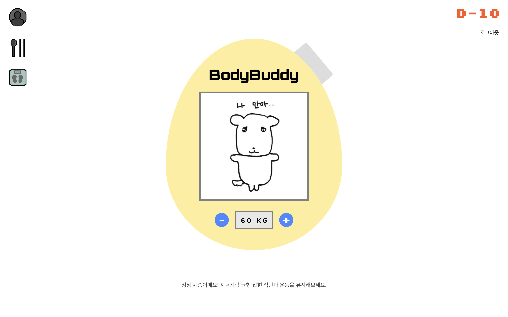

# BodyBuddy
현대인의 체중 관리와 건강한 습관 형성을 돕기 위해 개발되었습니다. <br>
사용자의 정보를 입력받아 BMI/BMR, 권장 칼로리 계산과 맞춤형 식단 구성등을 제공합니다.
## 멤버구성
 - 강지민 [(JM030220)](https://github.com/JM030220)
 - 차언주 [(djswn)](https://github.com/djswn)
 - 최지웅 [(cjww543210)](https://github.com/cjww543210)
## 데모 화면

## 프로젝트 구조
```
BodyBuddy/
├── utils/
├── static/ 
├── templates/
├── LICENSE
├── README.md
├── CONTRIBUTING.md
└── app.py
```
## 기술 스택
- Python
- Flask
- Bootstrap
- HTML5
- CSS3
- JavaScript
## 개발 환경
```
pip install flask
```
## 실행 방법
```
git clone https://github.com/djswn/BodyBuddy.git
cd BodyBuddy
python app.py
```
실행 후 http://127.0.0.1:5000 접속
## 주요 기능
1. 회원가입, 로그인 기능
2. 사용자 정보 기록
3. 개인의 BMI, BMR, 권장칼로리 계산
4. 상황에 따른 자동 멘트
5. 추천 식단 드롭다운 제시
6. 체중에 따라 동적 변화하는 캐릭터 화면
7. 체중 정보를 저장하여 나타내는 변동 그래프
8. 설정한 목표 기간이 다 되었을 때, 목표 체중 사이의 알림 기능
## 연락처
cej0836@naver.com
